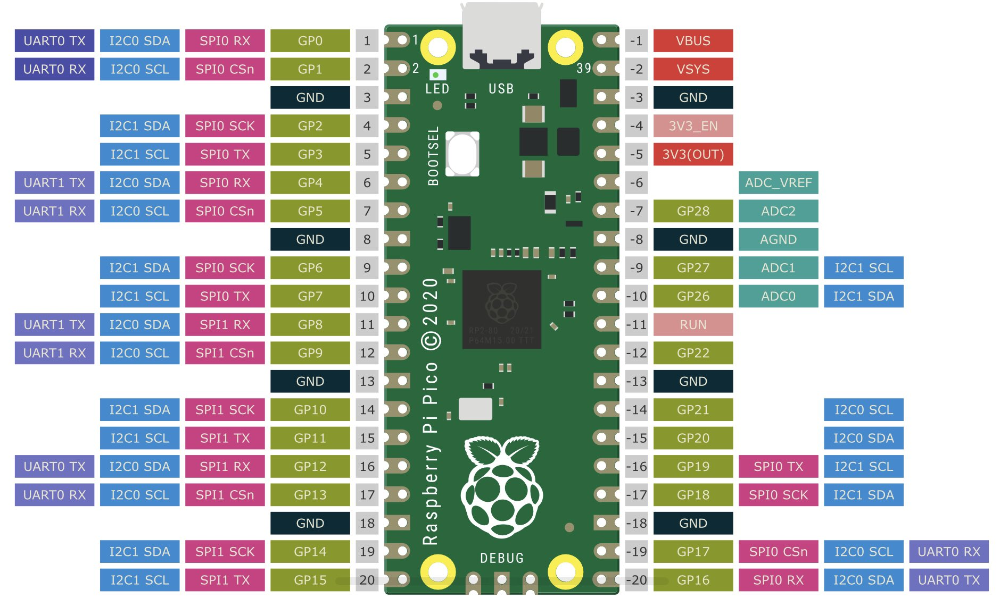

# Raspberry Pi Pico W Wireless Thermometer for HomeAssistant
I wanted to poke around a bit with the RP Pico W that was released a couple of days 
ago (July 2022). The difference from the Pico microcontroller from last year is that
this one has a WiFi radio (hence the W).

In a summary this piece of software does the following:

1. Connect to a WiFi network
2. Reads the temperature from a ds18b20 sensor wired to the Pico W board
3. Reports temperature to HomeAssistant by using a what they call an "HTTP sensor",
   you do not need to add any configuration in HomeAssistant for this to work.
4. Goes to deep sleep for 15 minutes
5. Starts over at 1.

# Components used
- 1 x Raspberry Pi Pico W
- 1 x breadboard
- 3 x dupont wire
- 1 x 4k7 resistor
- 1 x DS18B20 Digital Temperature Sensor (also known as Dallas)

# A teensy bit of work
What might be mildly off-putting is that the Pico W board is not sold with pre-soldered headers (yet), so 
you need to do a bit of soldering at three points. 

I'm not handy at all with soldering, if I can do it, you can.

As you can see in the picture below, I soldered on males to place it on the breadboard, in the 
schematic below it is assumed that you soldered on females or simply soldered the wires directly to 
the board (they're cheap enough).

# Schematic
Note that the schematic shows the Pico board, so there is no WiFi chip in the picture. The two 
boards are pin compatible, however.

# Pico pinout
For reference it might be handy to be able to look up the pin assignments of the Pico. Personally
I like to have it available when looking at schematics.

# Configuration
Right at the top of main.py you will find a section of code labelled "Configuration", these are
the things you need to set to your own values before writing the program to your controller.

# Installing
1. TODO: Link to official manual detailing how to get MicroPython installed on the board
2. Write main.py to the controller
3. Restart the device

_Notes on changing the code after installing_
- When the program is running, the on-board LED of the Pico board is lit. If 
  you are using a UI like the recommended Thonny, you can simply halt the 
  program when LED is on and update the program.

# TODO:
- Hook it up to a battery pack of 3 AA batteries (need to order one)
